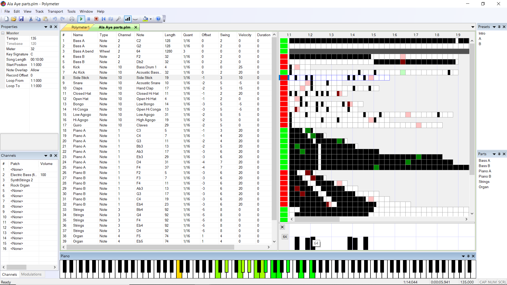

# Polymeter

Polymeter is a specialized MIDI sequencer for composing music in [polymeter](https://victimofleisure.github.io/Polymeter/Help/Concepts/Polymeter.htm), meaning music that uses multiple meters simultaneously. The application doesn't generate audio directly, instead it outputs a stream of MIDI messages to a [device](https://victimofleisure.github.io/Polymeter/Help/Options/MIDI/Output_Device.htm) that converts MIDI to audio, such as a hardware or software synthesizer. By default, the application outputs to the GS Wavetable Synth that ships with Windows. The application also [exports](https://victimofleisure.github.io/Polymeter/Help/Menus/File/Export.htm) a Standard MIDI file that can be imported into most music software.

A Polymeter document consists of an array of [tracks](https://victimofleisure.github.io/Polymeter/Help/Concepts/Tracks.htm), each of which produces a single MIDI note or control message at a time. Each track has its own [length](https://victimofleisure.github.io/Polymeter/Help/Views/Track_View/Track_Grid.htm#Track_Length) and loops independently through its own array of equal-sized [steps](https://victimofleisure.github.io/Polymeter/Help/Concepts/Steps.htm). For [note tracks](https://victimofleisure.github.io/Polymeter/Help/Tracks/Note_tracks.htm), the steps determine the starting times, durations, and velocities of notes, but steps are interpreted differently for other [track types](https://victimofleisure.github.io/Polymeter/Help/Concepts/Tracks.htm#Track_types). Tracks of differing lengths can be juxtaposed, and then edited while they're looping. Tracks can also [modulate](https://victimofleisure.github.io/Polymeter/Help/Concepts/Modulations.htm) other tracks, and can be arranged into [songs](https://victimofleisure.github.io/Polymeter/Help/Concepts/Songs.htm).

The application features multiple [views](https://victimofleisure.github.io/Polymeter/Help/Views/Views.htm), corresponding to different stages of the composing process, and various [docking windows](https://victimofleisure.github.io/Polymeter/Help/Docking_Windows/Docking_windows.htm). Most application parameters can be remotely controlled by [mapping](https://victimofleisure.github.io/Polymeter/Help/Concepts/Mappings.htm) them to MIDI messages.

The Polymeter MIDI Sequencer has its own [website](https://victimofleisure.github.io/Polymeter/). It also has a comprehensive user manual which is available in various forms:
* [One HTML page per topic](https://victimofleisure.github.io/Polymeter/helpframe.html) with a navigation frame
* [Single HTML page](https://victimofleisure.github.io/Polymeter/Help/printable/PolymeterHelp.htm) suitable for printing
* [PDF document](https://victimofleisure.github.io/Polymeter/Help/printable/PolymeterHelp.pdf) also suitable for printing
* [Single Wiki page](https://github.com/victimofleisure/Polymeter/wiki)
* Also available within the application as context-sensitive F1 help

MacOS or Linux users should check the [FAQ](https://victimofleisure.github.io/Polymeter/faq.html) for possible solutions. A  virtual desktop running actual Windows is best, but Wine may work passably. The release notes are (here)[https://victimofleisure.github.io/Polymeter/relnotes.html].

The Polymeter MIDI Sequencer evolved from [software I developed in the 1990s](https://victimofleisure.github.io/Polymeter/gallery/bongo.html) in order to compose [polymeter electronic dance music](https://victimofleisure.github.io/Polymeter/tools/tracks.html). I have used Polymeter exclusively since 2019, and it continues to evolve.